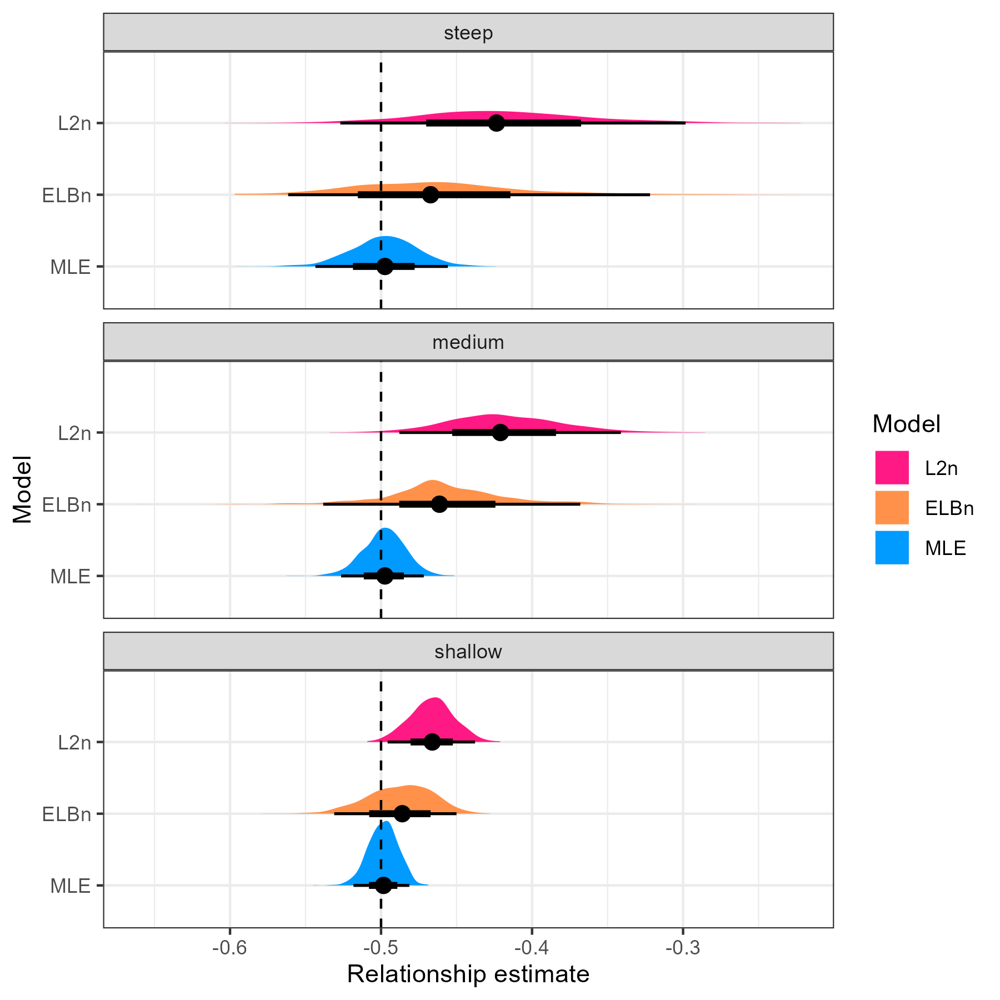
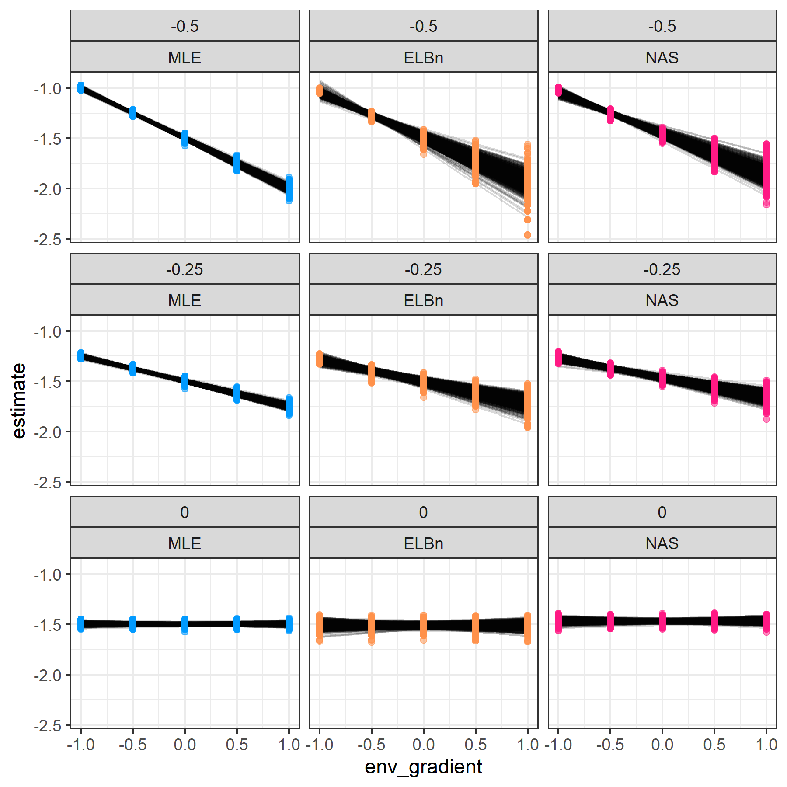
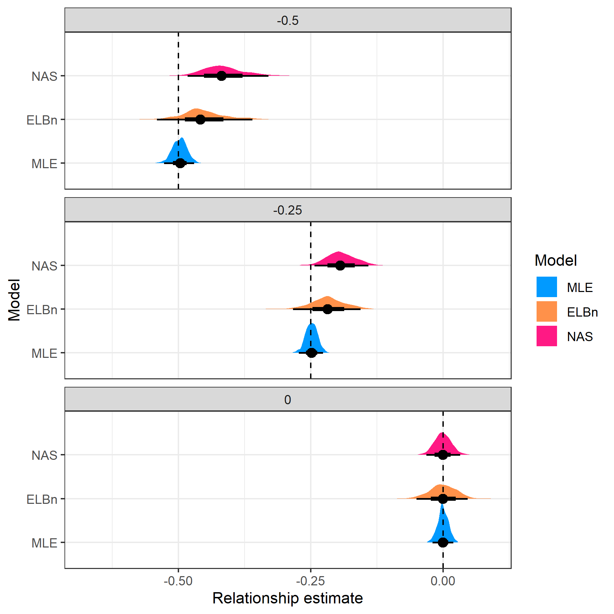

```{r setup, include=FALSE}
knitr::opts_chunk$set(
  echo = TRUE)
library(tidyverse)
```

**NOTE** I'm still working on integrating with Zotero and importing all the necessary references (thanks Jim for the help and instructions!). Don't worry about the **??** references in the rendered version for now. 

# Abstract

1.  The distribution of body size in communities  is remarkably consistent across habitats and taxa and can be represented by size spectra, which are described by a power law. The focus of size spectra analysis is to estimate the exponent ($\lambda$) of the power law.
2.  Many methods have been proposed for estimating $\lambda$ most of which involve binning the data, summing abundance within bins, and then fitting a ordinary least squares (OLS) regression in log-log space. However, recent work has shown that binning procedures may return biased estimates of size spectra exponents compared to procedures that directly estimate $\lambda$ using maximum likelihood estimation (MLE). Despite this variability in estimates, it is unclear if the relative change across environmental gradients is consistent across methodologies. Here, we used simulation to compare the ability of two binning methods (NAS, ELBn) and MLE to 1) recapture known values of $\lambda$, and 2) recapture parameters in a linear regression measuring the change in $\lambda$ across a hypothetical environmental gradient. We also compared the methods using two previously published body size datasets across a pollution gradient and a temperature gradient 
3.  Maximum likelihood methods always performed better than common binning methods, which demonstrated consistent bias depending on the simulated values of $\lambda$. This bias carried over to the regressions, which were more accurate when $\lambda$ was estimated using MLE compared to the binning procedures. Additionally, the variance in estimates using MLE methods is markedly reduced when compared to binning methods.
4.  The uncertainty and variation in estimates when using binning methods is often greater than or equal to the variation previously published in experimental and observational studies, bringing into question the effect size of previously published results. However, while the methods produced different slope estimates from previously published datasets, they were in qualitative agreement on the sign of those slopes (i.e., all negative or all positive). Our results provide further support for the direct estimation of $\lambda$ using MLE (or similar procedures) over the more common methods of binning. 

# Introduction

Body size distributions are a fundamental characteristic of communities. In general, size-abundance relationships are expected to scale with the value of -0.75 across all biological communities [@Damuth1981, @Damuth1991, @Damuth1998]. This is thought to be a consequence of simple size-dependent metabolic constraints on organisms’ energy use predicted by the metabolic theory of ecology [@Nee1991, @Brown2004]. The remarkable consistency of these relationships across spatiotemporal scales and ecosystems has led them to be recommended as a "universal" indicator of ecological status [@Petchey2010]. Variation in size-abundance relationships have been documented through space [@pomeranz2022], time [@evans2022], seasonality [@mcgarvey2018], and in response to human activities [@jennings2004]. Likewise, variation in size spectra relationships have been used to explain fundamental differences in how communities are organized. For example, external resource subsidies "bend the rules" and allow higher abundances of large body sizes than would be expected [@perkins2018]. However, recent research has shown that these results may be an artifact of how the data were treated. Edwards et al. (2020) reanalyzed a time series of marine fisheries data and found that previously reported changes through time were actually dependent on the methodology used. 

Individual size distributions (ISD *sensu* [@White2007], also referred to as abundance size spectra) are one of the size-abundance relationships commonly used. ISDs represent frequency distributions of individual body sizes within a community, regardless of taxonomy. Generally, there is a negative relationship between individual body size (M) on the *x*-axis  and abundance (N) on the *y*-axis. Theoretical and empirical data support this relationship being described as a simple power law with exponent $\lambda$ in the form of $N \sim M^{\lambda}$, where $\lambda = 2$ [@Sheldon1972, @Andersen2006a]. Commonly, $N$ is the count of body sizes grouped into bins, and $\lambda$ is estimated as the slope from OLS regressions in log-log space of $N$ and the mid point of the body size bin $M_{bin}$: $\log(N_{count}) = \lambda \log(M_{bin})$. Myriad binning methods have been proposed, including linear and logarithmic bin widths. Likewise, some methods rely on the absolute counts in the bins and others employ normalization techniques such as dividing the count by the bin width (especially common with logarithmic binning). As an alternative to binning methods, $\lambda$ can be estimated directly on un-binned data using maximum likelihood techniques.

Previous work has shown that the estimates of $\lambda$ differ between MLE and size-binned OLS techniques. Size-binned OLS methods are particularly sensitive to decisions made in the binning process. Simulation studies have shown that MLE offers consistently more accurate estimates of $\lambda$ (White et al. 2008, Edwards et al. 2017), and reanalysis of empirical data also indicates that the conclusions are dependent on the methodology used [@white2008 @edwards2020]. However, recent empirical analysis of stream macroinvertebrate communities across the National Ecological Observatory Network (NEON, USA) showed that while the estimates of $\lambda$ varied based on method, the relative change across the environmental gradient was consistent across methods [@pomeranz2022]. While there is a growing consensus that MLE methods offer more reliable estimates of $\lambda$, and binning methods result in biased estimates, it remains unclear if these biases are consistent and systematic or stochastic, and whether or not the relative change in ISD parameters is consistent across space and time. In other words, if the data within a study are all treated the same, does a relative change of size-binned OLS slope parameters of 0.1 coincide with a relative change of MLE $\lambda$ estimates of 0.1? 

We had Two primary objectives in this study: 1) to compare how well different methods estimate site-specific $\lambda$'s 2) To compare how different methods of estimating $\lambda$ impact subsequent regressions that use $\lambda$'s as a response variable. We did this using both simulated and empirical data sets. 

# Methods

## Data Simulation

To investigate the performance of commonly used methods, we simulate body size observations from a bounded power law distribution using the inverse method, as described in [@edwards2017]. Let $M$ be a random variable of body sizes described by the probability density function:

$$f(M) = CM^\lambda, M_{min} \le M \le M_{max}$$

$M_{min} = 0.0026$ and $M_{max} = 1.2 *10^3$. These values were based on empirical body sizes of stream benthic communities reported in [@pomeranz2022]. Our results were not dependent on the range of body sizes (Supplemental Information).

## Site-specific $\lambda$ estimates

Using the procedure above, we simulated $n = 1000$ body sizes from five different $\lambda$'s: (-1.5, -1.75, -2.00, -2.25, -2.5). The values of $\lambda$ describe how quickly the abundance of large body sizes decline within a community. For example, a value of -1.5 means there would be a relatively high number of large body sizes (shallow) whereas a value of -2.5 means there would be relatively very few large body sizes (steep). 

## Estimation of Size spectra parameter $\lambda$

After simulating data, we used three different methods (described below) to estimate the value of $\lambda$ (maximum likelihood, equal logarithmic bins, and normalized abundance spectra). We repeated this process 1000 times (reps) and plotted the distribution of values obtained for each method.  

## Maximum likelihood estimation (MLE)

We estimated the exponent $\lambda$ directly using MLE methods modified from the the `sizeSpectra` package [@edwards2017]. Throughout the manuscript, these estimates are referred to as MLE.

### Equal Logarithmic Bins: ELBn

In addition, to estimate the OLS slope parameter in log-log space, we used two common binning methods. . It is important to note that the log-log regression is estimating $\lambda$ as the regressionslope ($\beta_{1}$), and not $\lambda$ directly. In the interest of clarity, we will refer to all estimates of lambda as $\lambda$ regardless of the method used, and reserve the terms “parameters”, “intercept”, and “slope” $\beta_{env}$ to refer to the parameters of linear regression that uses the lambdas as a response variable.  

For the first binning method, we created 6 equal logarithmic bins covering the range of body sizes. This method has been used extensively in previous studies. For example see [@perkins2018, @martinez2016, @dossena2012]. In the present study, the count in each bin was normalized by dividing by the bin width to account for the unequal bin sizes. The process of normalizing shifts the estimate by -1. In other words, an un-normalized estimate of -0.75 would result in an estimate of -1.75 when normalizing the data [@sprules2015, @edwards2017, @pomeranz2022]. Throughout the manuscript, the normalized equal logarithmic binning method will be referred to as ELBn. 

### Log~2~ Bins: NAS
The second method was similar to ELBn, but bins of log~2~ widths are used. The number of bins is dependent on the range of body sizes present in the data. When working with empirical data with different size ranges this can alter the number of bins per site, and it is recommended to construct the bins based on the global min and max body size present. However, since the data here were simulated from a known size range, the number of bins for each site is identical. The count in each bin is normalized in the same way as described above. This method has been  used extensively in the literature [\e.g., @jennings2004, @Jennings2002, @sprules2015, @pomeranz2019; @mcgarvey2018) and is referred to as the Normalized Abundance Spectrum (NAS). 

For the two binning methods, simple OLS regression were conducted in the form 
$$Log_{10}(N) = \beta_0 + \beta_1 * Log_{10}(M)$$  

Where $N$ is the count in each bin, $M$ is the mid-point of each bin, and $\beta_{1}$ is considered to be the $\lambda_{estimate}$.


## Variation in $\lambda$ Across a Gradient

Previous work has investigated the biases in $\lambda$ estimates when using different methods [-@edwards2017, @edwards2020, @White2007]. However, the focus of the present work is to investigate biases when estimating the relationship parameters across an environmental gradient. 

To do this, we first simulated  $\lambda$'s from a linear regression with a known slope $\beta_{1}$ of -0.5 and intercept of -1.5 across a generic predictor variable x with values ranging from -1 to 1: 

$$\lambda_{ik} = \beta_{0} + \beta_{0}x_{ik}$$

This produced $k$ = 1000  values from each value of $x$ (-1, -0.5, 0, 0.5, 1), resulting in 5000 total $\lambda$’s. From each $\lambda$ we simulated 1000 individual body sizes using the procedure described above. 

Once the body size data were simulated, we then reversed the procedure. First, we used the three methods (NAS, ELBn, MLE) to estimate $\lambda$ for each of the 5000 body size datasets. Then we fit a linear regression to those data with the predictor variable $x$ and compared the resulting intercept ($\beta_{0}$) and slope ($\beta_{1}$) parameter estimates to the known value. The main results presented here were not dependent on the range of x-values or the number of sites (Supplemental Information).


## Empirical Data

We re-analyzed two data sets of benthic macroinvertebrate communities from stream habitats across two different gradients. In the first, quantitative macroinvertebrate samples were collected from streams across an acid mine drainage (AMD) stress gradient. Details of the sample collection and processing can be found in [@pomeranz2019]. Briefly, all individuals from each sample were identified to the lowest practical taxonomic unit and body lengths were measured using image processing software from photos taken with a camera mounted to a dissecting microscope. Body mass was estimated using taxon-specific published length weight regressions.

The second data set was from the wadeable stream sites of NEON [@NEON_Inverts2022]. NEON stream sites are located across a wide temperature gradient in the United States, from Puerto Rico to Alaska. Quantitative macroinvertebrate samples were collected using the most appropriate method based on the local habitat. All individuals were identified and had their body lengths measured, and body mass was estimated using published length weight regressions. This data has been analyzed previously using size spectra methods as described in [@pomeranz2022]. Detailed methods of the sampling collection and data processing methods can be in the macroinvertebrate DPI pubs found on the NEON website <https://www.neonscience.org/data-collection/macroinvertebrates>. Coefficient estimates ($\pm$ 1 standard deviation) are compared across methods. This allows us to determine whether or not the main results would differ depending on the method used.

## Performance Metrics


We compared performance of each procedure (NAS, ELBn, MLE) by first plotting the distribution of lambda or regression parameter estimates ($\lambda$, $\beta_{0}$, $\beta_{1}$) against the known values. We calculated bias for the procedures overall as the median absolute difference (averaged across all simulations) between the known values and the modeled estimates. Finally, for each procedure we estimated the width of the 95% CI’s to compare uncertainty.  

## Data Availabity

The data used in this manuscript is already publicly available [@Pomeranz2019] data dryad DOI <https://datadryad.org/stash/dataset/doi:10.5061/dryad.v6g985s>, [@NEON_Inverts2022]. R Scripts to reproduce the full simulation and analysis are available at: ([<https://github.com/Jpomz/detecting-spectra-differences>]). (To be archived upon acceptance.)  

# Results

# $\lambda$ estimates

There was considerable variation in the $\lambda$ estimate across methodologies (Figure 1). The distribution of estimates from the MLE method was almost always symmetrical and centered at the known value of $\lambda$ (Figure 1, blue distribution and dashed line). The distribution of estimates from the binning methods were generally wider, and sometimes showed assymetrical distributions. 


Furthermore, the binning methods systematically over estimated steep size spectra relationships ($\lambda = ~\sim-2.5~to-1.5$, Figure 2), and slightly underestimated shallow size spectra relationships ($\lambda = ~\sim-0.5$). This finding was more pronounced in the NAS method compared with the ELBn method.  


## Relationship across the hypothetical environmental gradient

### $\lambda$ "windows"

Because of the different performance of the two binning methods at steep and shallow values of lambdas, we first investigated how well the methods capture a known relationship of $\beta_{env} = -0.5$ across a hypothetical environmental gradient. The lambda "windows" are steep (-2.5, -1.5), medium (-2, -1) and shallow (-1.5, -0.5). 



The distribution of relationship estimates from the MLE method (Figure 3, blue) is approximately centered at the known relationship value in each of the "windows". The distribution for the MLE estimate is widest in the "steep" window, but is still markedly narrower than the binning methods. In addition to having much wider distributions, the binning methods systematically overestimate the known relationship.

### Varying the Known Relationship

Finally, we were interested in finding if the three methods performed differently with varying values of the known relationship. Here, we present estimates from each method when the known relationship ($\beta_{env}$) across the hypothetical gradient was -0.5, -0.25, and 0, respectively (Figure 4). 




Likewise, we also present the distribution of the $\beta_{env}$ relationship estimates (Figure 5). All the methods perform similarly and reasonably well when no relationship is present. The performance of the binning methods declines (center of distributions), with relationships being systematically over estimated. Likewise, the width of the distributions increases with stronger relationships across a hypothetical gradient. However, the distribution of estimates from the MLE method is nearly always centered at the known value, and has relatively narrow distributions. 




## Empirical data

For both empirical data sets, the direction and magnitude of change (i.e. $\beta_1$ coefficients) are generally in agreement. Size spectra parameters consistently increase (become flatter) in the AMD data (Fig. 6A). However, the magnitude of the change across the AMD gradient is weakest using the MLE method, and the width of the estimates ($\pm$ 1 SD) is larger in the binning methods, particularly the ELBn method (Fig. 6B). Likewise, the size spectra parameters consistently increase (become steeper) with increasing temperature across the NEON sites (Fig. 6C). The magnitude of the relationships is weakest in the MLE method, although the uncertainty around the estimates are similar (Fig. 6D). 

\newpage


\newpage

The $\beta_1$ coefficient estimates for the AMD data are all positive and of relatively similar magnitudes across methods. The MLE estimate has the smallest magnitude and SD (0.063 $\pm$ 0.011 SD), The ELBn method is slightly larger and has a wider SD : (0.072 $\pm$ 0.018). Finally, the NAS method has the largest estimate and an intermediate standard deviation (0.076 $\pm$ 0.013). The range of the gradient in the AMD data is relatively small (9.5), but the absolute change in the size spectra parameter ($\lambda$) across the AMD gradient vary by ~0.13 units depending on the method used (range of absolute change: 0.59 to 0.72).

Similar to the AMD results, the $\beta_1$ coefficient estimates for the NEON data are all negative and have similar magnitudes across methods. The MLE estimate is once again the smallest (-0.006 $\pm$ 0.001 SD). The NAS and ELBn methods are larger at -0.004 $\pm$ 0.002, and -0.002 $\pm$ 0.002, respectively. Although the estimates are similar and have a small magnitude, the range of the gradient in this data is larger (\~30$\circ$C), meaning that the absolute change in $\lambda$ estimates varies by 0.11 units depending on the methods used (range of absolute change across gradient: 0.06 to 0.17). 


# Discussion

The relationship between body size and abundance has been extensively studied in a wide range of taxa inhabiting both terrestrial and aquatic ecosystems (reviewed by [@brown1995, GastonBlackburn2000, @White2007]). Empirical patterns are remarkably consistent, and can be explained by the metabolic theory of Ecology [@Brown2004].  Measuring parameters describing the decline in abundance with increasing body size in communities is being done with increasing frequency across ecology. Previous work has investigated the accuracy and inherent biases associated with different estimation methods. However, how these inaccuracies and biases compound across environmental gradients remains uncertain, making it difficult to detect variation in size spectra parameters across environmental gradients with confidence. Here, we sampled body sizes from known distributions with varying parameters ($\lambda$) and estimated the coefficient of the relationship ($\beta_{env}$) across a hypothetical gradient in order to assess how the results would vary depending on the method used. Likewise, we compared how the interpretation of previously published results could change depending on the methodology used to estimate the relationship.

Generally, the estimate of the size spectra parameter from the MLE method was always closer to the known $\lambda$ value, regardless of how steep or shallow the $\lambda$ exponent was. This is in agreement with Edwards et at. (2017) which found that the MLE estimate more consistently recovered known $\lambda$ values ranging from -2.5 to -0.5. We further this work by discovering that the magnitude of the error associated with the two binning methods increases as the $\lambda$ value moves away from $\sim$ -1. 

It is unsurprising that all methods performed less well in estimating steep values of $\lambda$ (i.e., -2.5). The rapid decline of large body sizes makes it unlikely to sample any individuals with a large body size. Furthermore, the binning methods inherently "lose" data by aggregating individual observations into a single bin. 

Likewise, the MLE method also resulted in the most accurate $\beta_{env}$ estimates for the hypothetical relationship in simulated data regardless of the $\lambda$ "window" investigated. Furthermore, the variation around the estimate was always smallest with the MLE method. However, the variation in the MLE estimate did increase with steeper $\lambda$ "windows". This is not surprising, however because steep relationships like this make it very unlikely to sample the largest body sizes, and capturing the "true" relationships without the full range of body sizes present is more difficult (Edwards et al. 2017). Despite this, the MLE method is nearly always the best option to use, likely because all the data are used in the analysis. 

Binning methods are easy to use and interpret, which most likely accounts for their wide use in ecological studies. However, aggregating individuals into logarithmic bins removes a large source of the variation within the data by collapsing body size variation into a single value within each bin. For example, all individuals placed into a bin that ranges from 2-4 grams of mass are all treated as having a mass of 3 grams, the midpoint of that bin. Likewise, a single abundance value is taken for this bin, despite that fact that there is almost certainly variation in the abundance of individuals that weigh \~2, \~3, or \~4 grams. By homogenizing the data in this way, it seems that binning methods will always produce noisier results than MLE from the binning process alone, since binning is akin to deleting information that the model could otherwise use. One of the benefits of using MLE is that all data points are retained for use within the model.

The variation in estimated relationships across the empirical datasets varied by ~0.1 units depending on the method used. At first glance this may not appear to be a concerning magnitude of variation. However, when one considers the range of variation reported in many seminal works on variation in size spectra relationships is ~0.1-0.2 (SI Table *xx*), it becomes clear how important an error in estimates of this magnitude is. 

Despite the differences in magnitude of the empirical relationship coefficients, they were generally in the correct direction and of a similar magnitude. This suggests that previously reported significant changes in size spectra parameters across environmental gradients and in experimental manipulations are plausible. Given that all of the data within a study is treated identically, the over all change in size spectra parameters is likely reasonable. However, the biases and inconsistencies in relationship estimates presented here suggest that it would be difficult if not impossible to directly compare the relative changes across different published studies which use different methods. However, the relatively systematic error of $\lambda$ estimates across known exponents suggests that it may be possible to correct previous estimates onto the same scale (Figure 2).  

Despite this possibility, publication of individual body size data with future studies of size spectra relationships would greatly aid in our ability to generalize changes to this fundamental aspect of community organization across spatiotemporal scales and in response to environmental conditions.

## Concluding Remarks

The MLE method outperformed both of the binning methods under nearly any measure. With the publication of the *sizespectra* package [-@edwards2017], producing MLE estimates of size spectra parameters is a relatively easy task. Therefore, we recommend using this in all future studies of size spectra relationships.

We reiterate the recommendations of [-@White2007, -@sprules2015, -@edwards2017] to estimate size spectra relationships using MLE methods due to their superior performance in nearly every context. Furthermore, we strongly encourage authors to publish individual size data whenever possible. This will allow for the consistent re-analysis of existing data sets as methodologies develop and improve. This will aid in the ability for size spectra work to be synthesized between research groups and across scales.

\newpage

# References

::: {#refs}
:::

\newpage

# Supplementary material {.unnumbered}

```{=tex}
\beginsupplement
```
# $\lambda$ and relationship estimates

In the main analysis, we simulate body size data from bounded power law distributions while varying the $\lambda$ exponent which describes the distribution. For the results presented in the main text, we held the number of sites at 5, scaled the environmental gradient from -1 to 1, and set the minimum and maximum body sizes to $0.0026$ and $1.2 *10^3$ respectively. Here, we plot the results of varying the number of sites (3, 10), increasing the scale of the environmental gradient (-100 to 100) and decreasing the range of body sizes (min = 1, max = 100). Generally, the results reported in the main manuscript are robust to changing these parameters: the MLE estimate is nearly always closer to the known parameters, and the variation in these estimates is usually smaller than the binning methods.

## Varying number of sites

### 10 sites


\newpage


\newpage


\newpage

### Three sites


\newpage


\newpage


\newpage

## Large environmental gradient


\newpage


\newpage


\newpage

## Range of body sizes, $M$


\newpage


\newpage

## Sample size, $n$

The number of observations in our simulations may bias the results. Therefore, we repeated the simulations described above, but varied the sample size $n$. We tested values of $n = 200, 500, 1000, 5000, 10 000$. Results of this analysis are presented in the Supplemental Information. 


\newpage


\newpage

### Range of body sizes = 1 to 100


\newpage


# Comparison with other published estimates

SI Table. This table shows published estimates of the variation in size spectra slopes (or exponents) in empirical studies. It is unclear how to directly compare estimates of the slope with different methods.However, the published estimates here range from ~0.1 to 0.2 across the gradients studied. For comparison, the 2.5-95% quantiles around the relationship estimate for the MLE method were ~0.1, whereas for the ELBn and NAS method they were ~0.25 and ~0.2, respectively. b_diff is the change in estimate (b-low - b-min). System refers to stream communities or mesocosm experiments. Method: MLE = maximum likelihod estimate, ELB = equal logarthmic binning, the number before indicates the number of bins used. The normalization process shifts the estimates by an absolute value of 1.0. Hence, direct comparison the relative change in normalized and non-normalized studies should not introduce any bias. The O'Gorman et al. 2017 study used average species size and abundance (Local Size Density Relationship, *sensu* White et al. 2007) as opposed to individual size distribution. These methods are related, but it is unclear how to directly compare estimates from each method. 

```{r, echo=FALSE}
df <- read.csv("lit comparison.csv")
knitr::kable(df,
             col.names = c("Citation",
                           "$\\beta_1$ Difference",
                           "Error", 
                           "Error Type",
                           "$\\beta_{low}$",
                           "$\\beta_{high}$",
                           "System",
                           "Driver", 
                           "Method"))

```

```{r, echo=TRUE}
# kable() above looks awful
# here is another bad option
# if we decide to include this I'll make it look nice in excel. 
read.csv("lit comparison.csv")
```

