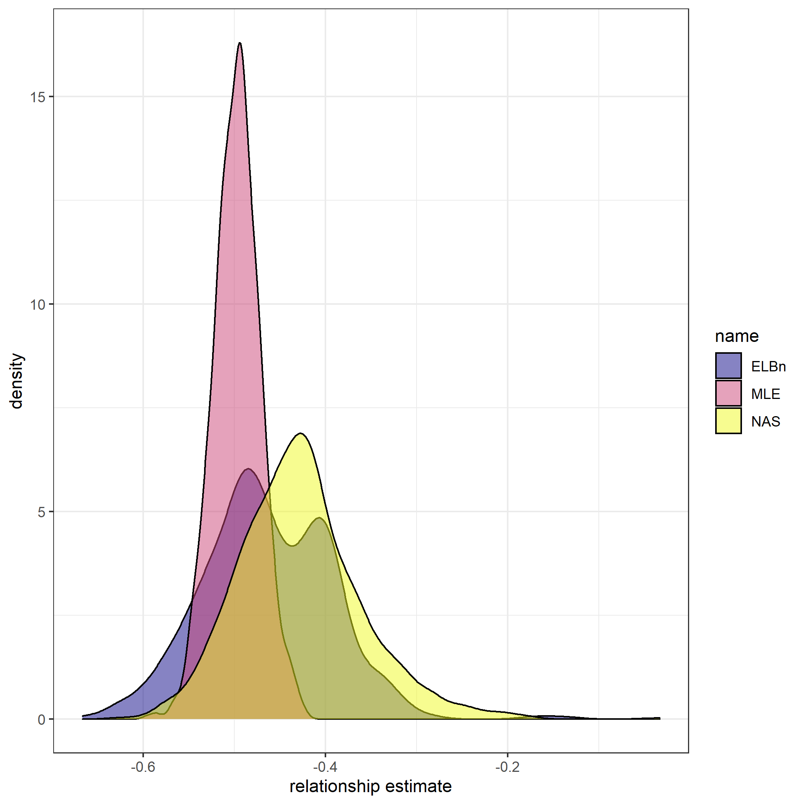
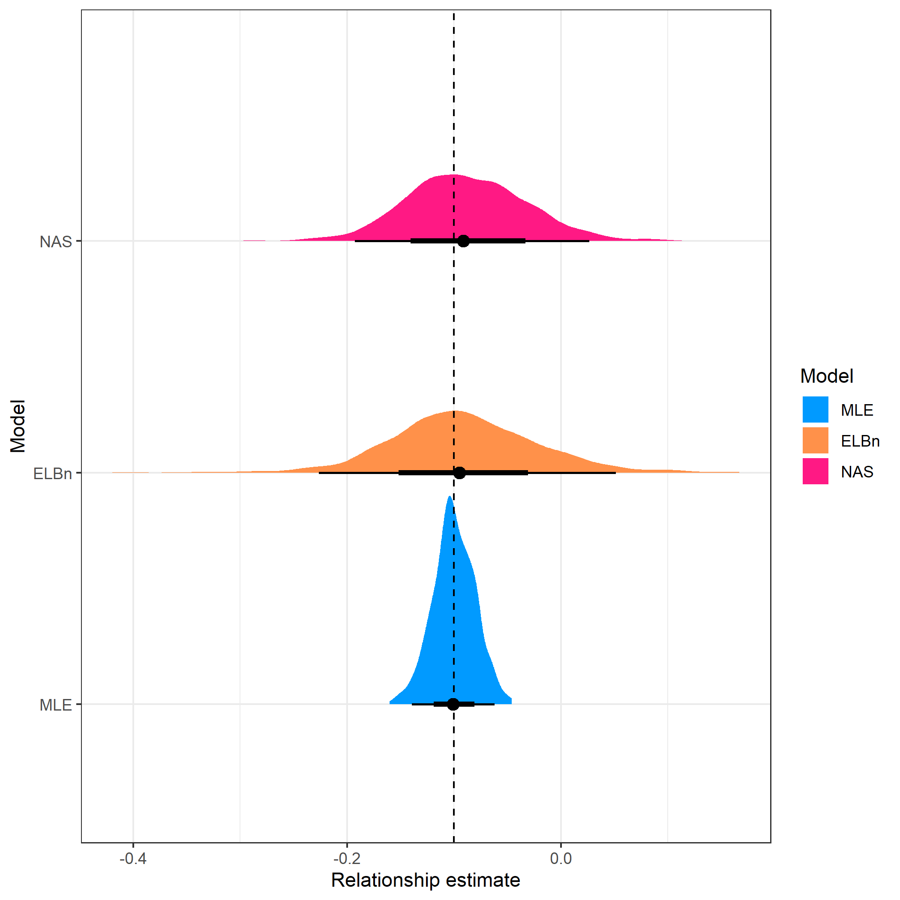
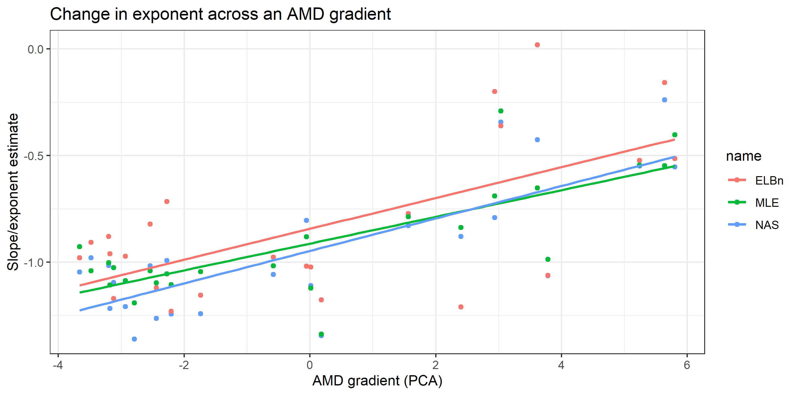
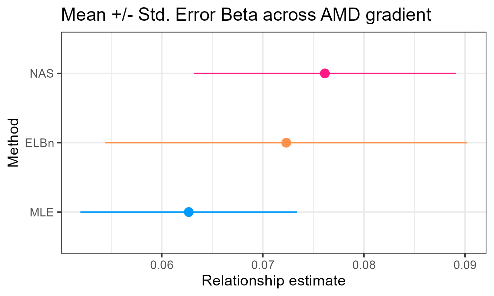
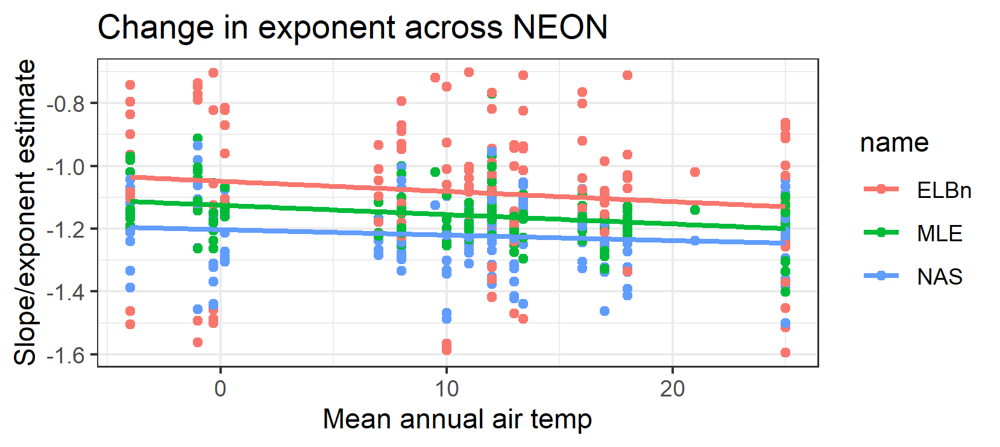
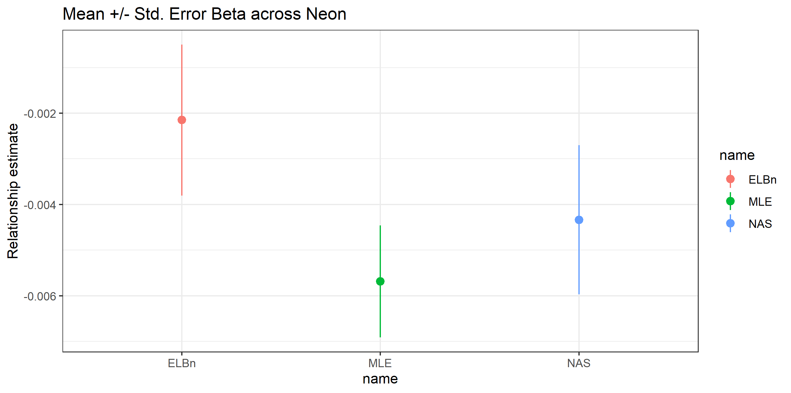
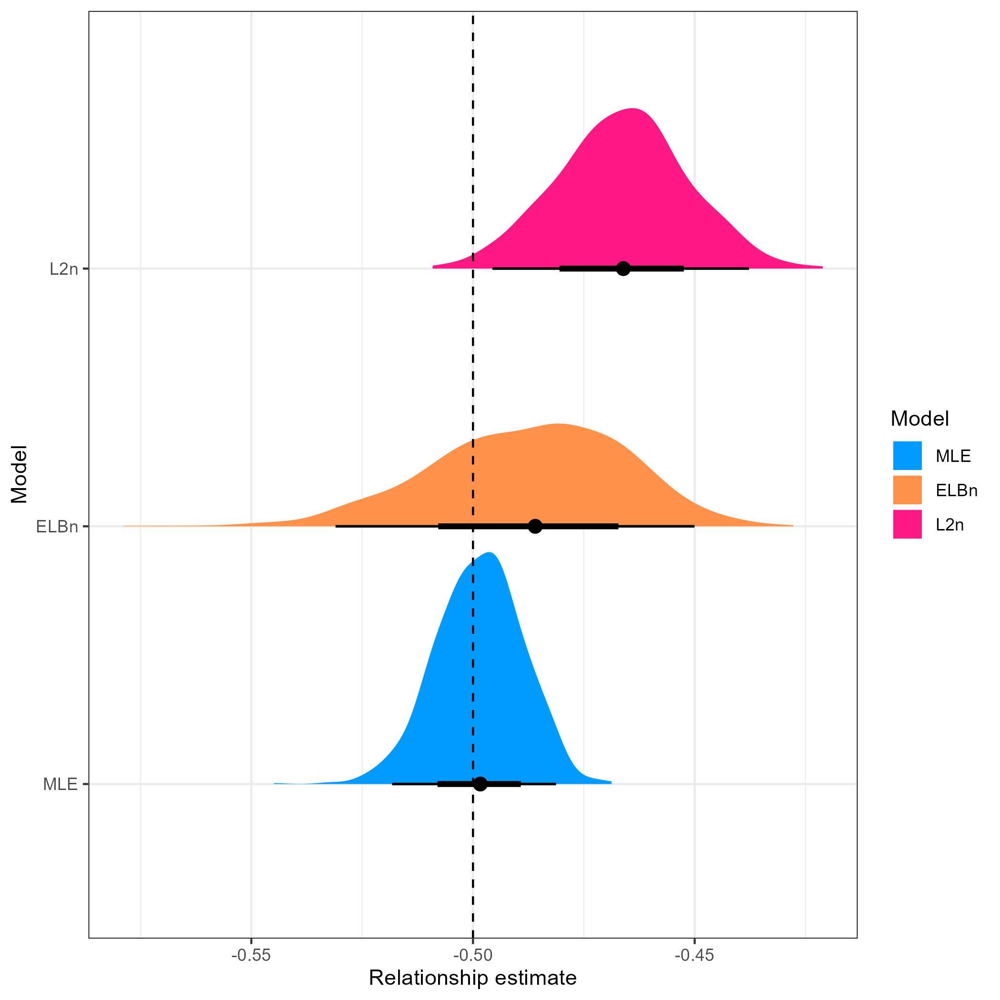
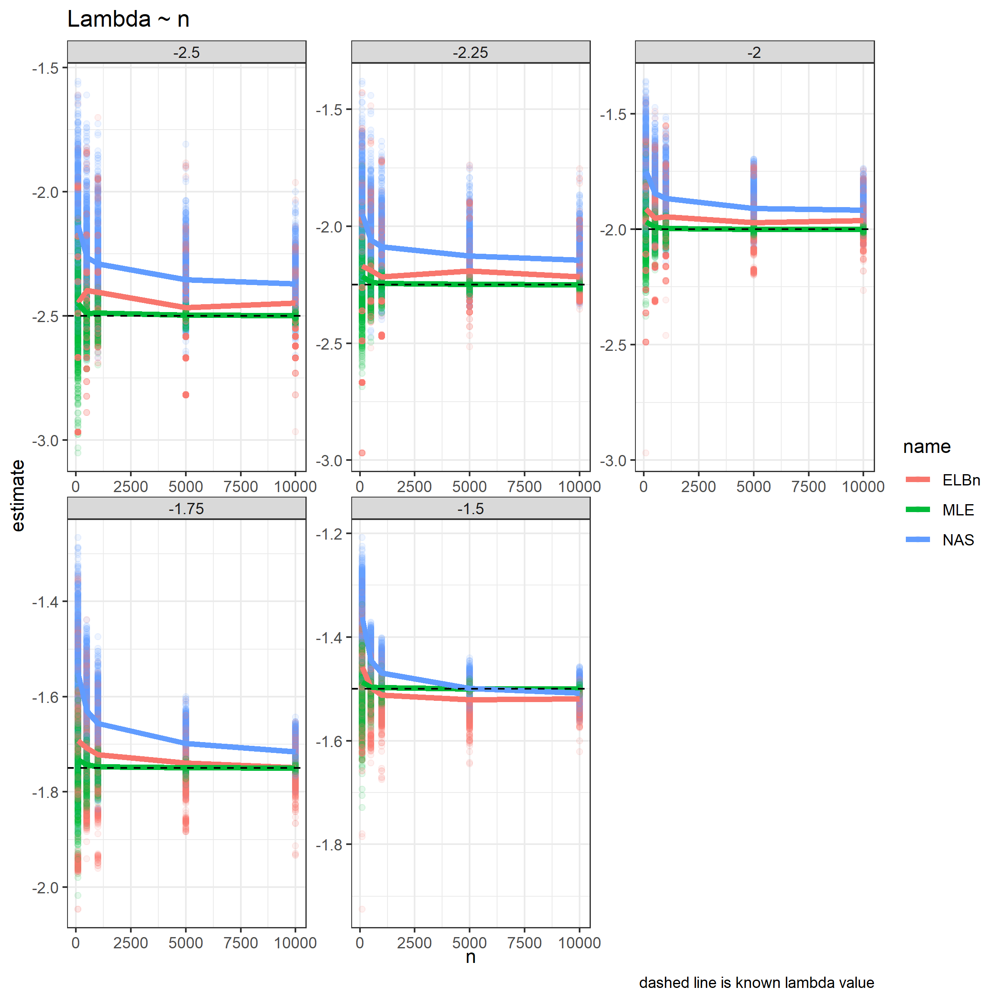

```{r setup, include=FALSE}
knitr::opts_chunk$set(
  echo = TRUE)
```

**NOTE** I need to integrate reference manager with R markdown. Any favorites or recommendations?? I generally use Zotero (free), but think I have access to Mendeley through CMU...

**NOTE** I re-ran all of these after setting the seed for reproducibility. Figures should be up to date, but the numbers may change slightly i.e., 94.8% might become 95.1%, mean $\pm$ SD values will be different. 

# Abstract

1.  Size spectra represent a fundamental attribute of community organization and are increasingly being used in assessments of fresh waters.
2.  Many methods have been proposed for constructing size spectra relationships, but recent work has shown that varied methods return biased estimates of relationship parameters, and different methods in fact are not estimating the same parameter. Despite this variability in estimates, it is unclear if the relative change across environmental gradients is consistent across methodologies. Here, we simulate data sets across an hypothetical environmental gradient and estimate the size spectra parameter (slope or exponent, depending on method) at each site, and, importantly, estimate the relationship of parameters across the hypothetical gradient. We also use two previously published body size datasets across an anthropogenic stress gradient and an environmental temperature gradient and assess how the conclusions of these studies would vary based on methods used.
3.  We find that maximum likelihood methods always perform as well or better than common binning methods. Additionally, the variance in estimates using MLE methods is markedly reduced when compared to binning methods.
4.  The uncertainty and variation in estimates when using binning methods is often greater than or equal to the variation previously published in experimental and observational studies, bringing into question the effect size of previously published results. However, re-analysis of two previously published datasets does not markedly alter the conclusions reached. Further study is needed to identify how and when these estimates may be biased, and when the general pattern of results can be considered to be "true".

# Introduction

Body size distributions are a fundamental characteristic of communities. The remarkable consistency of these relationships across spatiotemporal scales and habitat types has led them to be recommended as a "universal" indicator of ecological status (Petchey and Belgrano 2010). Size metrics have commonly been used in marine systems, and are increasingly being applied to assess the condition of freshwater ecosystems (Martinez et al. 2016, Pomeranz 2018).

Individual size distributions (ISD, also referred to as abundance size spectra) are commonly used. Generally, there is a negative relationship between body size (M) and abundance (N). Theoretical and empirical data support this relationship being described as a simple power law with exponent $\lambda$ in the form of $N \sim M^{\lambda}$. Commonly, $N$ is the count of body sizes grouped into bins, and $\lambda$ is estimated from OLS regressions of log transformed data of $N$ and the mid point of the body size bin $M_{bin}$: $\log(N_{count}) = \lambda \log(M_{bin})$. Myriad binning methods have been proposed, including linear and logarithmic bin widths. Likewise, methods can rely on the absolute count in the bins as well as normalization techniques where the count is divided by the bin width (especially common with logarithmic binning). Alternatively, $\lambda$ can be estimated directly using maximum likelihood techniques.

Previous work has shown that the estimates of $\lambda$ differ between MLE and OLS techniques. OLS methods are particularly sensitive to decisions made in the binning process. Simulation studies have shown that MLE offers consistently more accurate estimates of $\lambda$ (White et al. 2007, Edwards et al. 2017), and reanalysis of empirical datasets also indicates that the conclusions are dependent on the methodology used (White et al. 2007, Edwards et al. 2020). However, recent empirical analysis of stream macroinvertebrate communities across the NAtional Ecological Observatory Network (NEON, USA) showed that while the estimates of $\lambda$ varied, the relative change across the environmental gradient was consistent regardless of method used (Pomeranz et al. 2022). While there is a growing consensus that MLE methods offer more reliable estimates of $\lambda$, and binning methods result in biased estimates, it remains unclear if these biases are consistent and systematic or stochastic, and whether or not the relative change in ISD parameters is consistent across space and time. In other words, if the data within a study are all treated the same, does a relative change of OLS slope parameters of 0.1 coincide with a relative change of MLE estimates of 0.1? In order to answer this question, we simulate body size observations from bounded power law distributions with varied $\lambda$ exponents across a hypothetical environmental gradient and compare the results obtained using three different methodologies common in the literature. In addition, we re-analyze two previously published datasets of stream community body sizes across a stress and environmental gradient. We find that the MLE method more accurately estimates the site-specific $\lambda$ exponents as well as the relative change in exponents across the hypothetical gradient, as well as having smaller variation. The logarthmic binning methods generally perform well, but have larger confidence intervals around the estimates. However, the overall conclusions of previously published empirical data sets are not dependent on the method used.

# Methods

## Data Simulation

In order to investigate the performance of commonly used methods, we simulate body size observations from a bounded power law distribution using the inverse method, as described in Edwards et al. (2017). Let $M$ be a random variable of body sizes described by the probability density function:

$$f(M) = CM^\lambda, M_{min} \le M \le M_{max} $$

$M_{min} = 0.0026$ and $M_{max} = 1.2 *10^3$. These values are based on empirical body sizes of stream benthic communities reported in Pomeranz et al. (2020). Our results are not dependent on the range of body sizes, and we show the results of other ranges in the supplemental information.

For the main analysis, presented here, we sampled $n = 1000$ body sizes from distributions described by five different $\lambda$'s: (-1.5, -1.75, -2.00, -2.25, -2.5). The supplemental information contains results when the value of n is varied (or maybe include in main?). Each value of $\lambda$ was assumed to come from a community across a hypothetical environmental gradient $X$. Values of $X$ for each community are uniformly distributed from -1 to 1. We repeated the data simulation 1000 times (reps). The main results presented here were not dependent on the range of *x*-values or the number of sites (supplemental information).

### Sample size, n

The number of observations in our simulations may bias the results. Therefore, we repeated the simulations described above, but varied the sample size $n$. We tested values of $n = 200, 500, 1000, 5000, 10 000$. (originally had n=100, but thre errors based on random seed. Bumped it to 200 to try and get consistent error-free runs)

### "No" relationship

It is possible that our sampling or simulation framework could impact the results obtained, possibly by inflating the type I error rate. In order to assess whether or not our simulations are robust to this, we performed independent random samples from a bounded power law for five communities across a hypothetical gradient as described above, but we set $\lambda = -2$ for all five communities. Hence, we are simulating a scenario where the size spectra relationship is invariant to our hypothetical environmental gradient, and we should expect the estimated relationship coefficient $\beta_1 = 0$.

## Finer resolution of $\lambda$ values

For the main analysis, we were interested in determining whether or not the methods were able to detect relatively coarse changes to size spectra parameters, specifically, a change of 0.5 units across each value of $X$, or an absolute change or 1.0 units. However, many seminal works on variation in size spectra relationships in freshwater are on a much finer scale (on the order 0f 0.1 to 0.25 units). Therefore, we performed simulations as described above, but varied $\lambda$ from -1.9 to -2.1 across the hypothetical environmental gradient. This equates to a know relationship coefficient of $\beta_1 = 0.1$ across the hypothetical gradient, and an absolute change of 0.2 units.

## Estimation of Size spectra parameter $\lambda$

For each sample of $M$ and each of the 1000 replicates, we estimated the exponent $\lambda$ using MLE methods modified from the the `sizeSpectra` package (Edwards et al. 2020). In addition, we use two common binning methods to estimate the OLS slope parameter in log-log space. For the first binning method, we created 6 equal logarithmic bins covering the range of body sizes. The count in each bin was normalized by dividing by the bin width. This method has been used by (refs here, I think a lot of Woodward's group uses this...) Throughout the manuscript, the normalized equal logarithmic binning method will be referred to as ELBn. The second method was similar to ELBn, but bins of Log~2~ widths are used. The count in each bin is normalized in the same way. This method has been used by (Pomeranz et al. 2018, I **think** McGarvey \~2018, Blanchard (log 2, ?normalized?)) and is referred to as the Normalized Abundance Spectrum (NAS).

## Estimation of relationship across gradient, $\beta_1$

For each simulation replicate, we estimated how the size spectra parameters varied across the hypothetical gradient. Simple OLS regression were conducted in the form $\lambda_{estimate} ~ \beta_0 + \beta_1 * X$. The distribution of the relationship coefficient, $\beta_1$, were plotted compared to the known relationship. Likewise, the confidence interval of $\beta_1$ was assessed to determine the proportion of estimates which contained the true value of the known relationship.

## Empirical Data

We re-analyze two datasets of benthic macroinvertebrate communities from stream habitats across two different gradients. In the first, quantitative macroinvertebrate samples were collected from streams across an acid mine drainage stress gradient. Details of the sample collection and processing can be found in Pomeranz et al. (2018). Briefly, all individuals from each sample were identified to the lowest practical taxonomic unit and body lengths were measured using image processing software from photos taken with a camera mounted to a dissecting microscope. Body mass was estimated using published length weight regressions.

The second data set was from the wadeable stream sites of the National Ecological Observatory Network (NEON; **data product XXX**). These sites are located across a wide temperature gradient in the United States, from Puerto Rico to Alaska. Quantitative macroinvertebrate samples were collected using the most appropriate method based on the local habitat. All individuals were identified and had their body lengths measured, and body mass was estimated using published length weight regressions. This data has been analyzed previously using size spectra methods as described in Pomeranz et al. (2022). Detailed methods of the sampling collection and data processing methods can be found on the NEON website (URL, or macroinvertebrate DPI pubs).

# Results

## Relationship across the hypothetical environmental gradient


All methods performed reasonably well in detecting the known relationship across the hypothetical environmental gradient. The regressions using the MLE method found a significant relationship 100% of the time, while the ELBn and NAS method found significant relatoinships 95.8% and 96.9% of the time, respectively. 

The confidence intervals for the relationship coefficients ($\beta_1$) for both the MLE and ELBn method contained the true value of the known relationship across the gradient $\ge$ 95% of the time, whereas the confidence interval for the NAS method only had the true value 83.1% of the time. Despite having similar accuracy, the width of the CIs for the ELBn method were more than 3 times that of the MLE method (ELBn_CI_ = 0.386 $\pm$ 0.20; MLE_CI_ = 0.121 $\pm$ 0.056). The CI's for the NAS were slightly smaller than the ELBn method, but still $>$ 2.5 times as wide as the MLE method (NAS_CI = 0.339 $\pm$ 0.172). 

On average, the relationship across the gradient was under estimated: MLE -0.002 ($\pm$ 0.022); ELBn -0.039 ($\pm$ 0.062); and NA -0.081 ($\pm$ 0.061).



Interestingly, there was an interactive effect of the estimate accuracy between sample size and the value of $\lambda$. All methods were more accurate with larger sample sizes, and smaller values of $\lambda$.


## No relationship

All of the methods performed similarly when there was no relationship across the hypothetical gradient. The Type I error rate for MLE, ELBn and NAS were 5%, 5.7% and 4.6%, respectively. However, the confidence intervals for the binning methods were \~3 times as wide as the MLE method (mean CI widths: MLE = 0.116, ELBn = 0.372; NAS = 0.332).

Of the relationships which were estimated to be significant, the MLE, ELBn, and NAS method had a 58%, 49.1% and 54.3% probability of indicating a negative relationship, respectively.


## Small variation in lambda

The performance of all methods declined when trying to detect variation in the $\lambda$ parameter between -1.9 to -2.1 across the environmental gradient. The mean $\beta_1$ coefficient estimates for all methods were closely associated with the known relationship. Once again the variation in the estimates using the MLE method were much smaller that the estimates using both of the binning methods (Figure 4).



Of the 1000 simulation replicates, the MLE only detected a significant relationship 90% of the time, whereas the ELBn and NAS methods detected significant relationships 19 and 23% of the time, respectively. Of the replicates which were significant, the confidence interval contained the true value of the relationship 94.6, 88.4, and 89.1% of the time for the MLE, ELBn, and NAS methods, respectively.


Once again, the width of the confidence intervals for both of the binning methods were $\ge$ 2.8 times that of the MLE method (mean $\pm$ SD MLE CI width: 0.117 $\pm$ 0.051; ELBn CI width: 0.378 $\pm$ 0.169; NAS CI width: 0.332 $\pm$ 0.150).

On average, the relationship estimates across the gradient were similar to the know value (mean deviation: MLE = 0.00001, ELBn = -0.009, NAS = -0.012). However, when only looking at the relationships which were significant, this variation increased considerably(MLE = -0.002, ELBN = -0.052, NAS = 0.034). 


## Empirical data

For both empirical datasets, the direction and magnitude of chnage (i.e. $\beta_1$ coefficients) are generally in agreement. Size spectra parameters consistently increase (become flatter) in the AMD data (Fig. XX A). Likewise, the size spectra parameters consistently increase (become steeper) with increasing temperature across the NEON sites (Fig XX D)

**NOTE** combine all the figures below into one with 4 panels (AMD = A, B; NEON = C, D)









Because the $\beta_1$ coefficient estimates are similar, and the range of the gradient in the AMD data is relatively small (9.5), the absolute change in the size spectra parameter across the AMD gradient are similar regardless of method used (range: 0.59 to 0.72). Likewise, the absolute change in size spectra parameters across the NEON temperature gradient ranges from 0.06 to 0.165, depending on the method used.

*alternative* absolute difference of \~0.1 units in $\lambda$ across gradients is similar to differences reported in other studies (seasonally: 0.16, Mcgarvey and Kirk; landuse: 0.15 Martinez; O'Gorman 2017 \~0.25, Yvon and Dossena papers \~0.1? [need to redownload some of these and compare])

## Simulating shallower lambdas

Estimates of the relationship between lambda and a hypothetical gradient varied depending on the method used. However, interpretations of empirical data were broadly consistent across methodologies. Upon closer inspection, the values of size spectra parameters in the empirical data were considerably shallower than -2. Given that we found the performance of all methods increased with shallower $\lambda$'s we wanted to investigate how the methods performed with simulated values more similar to the empirical estimates of parameters describing size spectra relationships. Therefore, we repeated the simulation process as in the main analysis, but used $\lambda$ values ranging from -1.1 to -1.5.


We found generally less variability in the relationship estimates across a gradient of distributions described with shallower $\lambda$ parameters. All of the relationship coefficient estimates ($\beta_1$)'s across all replicates were significant regardless of method used. The confidence interval for $\beta_1$ estimate for the MLE method contained the true value 94.7% of the time. However, the true value was in the confidence interval for the ELBN and NAS method only 90.9% and 76.9% of the time, respectively. Once again, the mean width of the CI for the binning methods were ~2 times as large as for the MLE method. Mean $\pm$ SD CI width: MLE = 0.0442 $\pm$ 0.0196; ELBn = 0.0920 $\pm$ 0.0482, NAS = 0.0798 $\pm$ 0.0324.

On average, the relationship across the gradient was under estimated, but by nearly an order of magnitude less than when simulating across steeper values of $\lambda$. Differences between known and estimated relationship coefficients: MLE -0.0007 ($\pm$ 0.0079); ELBn -0.0058 ($\pm$ 0.0177); NAS -0.0251 ($\pm$ 0.0124).



# Discussion

Measuring parameters describing the decline in abundance with increasing body size in communities is being done with increasing frequency across ecology. Previous work has investigated the accuracy and inherent biases associated with different estimation methods. However, how these innaccuracies and biases compound across environmental gradients remains uncertain, making it difficult to detecting variation in size spectra parameters across environmental gradients with confidence. Here, we sampled body sizes from known distributions and estimated their parameters across a hypothetical gradient in order to assess the relationship coefficients obtained.

Generally, there was large agreement in the direction and magnitude of average relationship coefficient estimates across methods. The estimate from the MLE method was always closer to the known relationship, and always had the smallest variation around the estimate.

All of the methods performed equally well when the $\lambda$ value did not vary across the hypothetical gradient, with a Type I error rate of \~5%, exactly as would be expected under the assumptions of frequentist statistics. This indicates that previous studies which have detected no difference in size spectra parameters across sites can be interpreted with confidence, regardless of the method used.

The performance of all methods improved as sample size increases, and as the exponent of the size spectra relationship gets larger (more shallow). As either or both of these variables change, the difference in estimated relationship coefficients declines across the methods. This is particularly interesting given the fact that both empirical data sets of stream communities examined here are shallower than the expected relationship of $\lambda = -2$, and the conclusions of the change in size spectra relationships across the gradients are not dependent on method used. If communities under study are in fact described by shallower exponents, the method used may not be critical in the conclusions reached. However, the MLE method performs as well or better than the two binning methods examined here under all contexts and should be the preferred method moving forward. At a minimum, future studies should report MLE estimates to ensure that the results are not dependent on the methodology used.

Alarmingly, the performance of all methods declined dramatically when trying to detect smaller variation in $\lambda$ values. We simulated observations from distributions varying by an absolute value of 0.2 units. This range of variation is similar to that which has been reported in many seminal works on variation in size spectra parameters. When using the MLE method, significant relationships were only detected \~88% of the time, whereas both of the binning methods only detected significant trends \~20% of the time. Of the simulation replicates which were significant, nearly all of them were negative across all methods except for one single replicate using the NAS method which was positive (Figure. 5).

Despite the drop in performance with reduced variation in $\lambda$ values, when a significant relationship was observed, it was generally in the correct direction and of a similar magnitude. This suggests that previously reported significant changes in size spectra parameters across environmental gradients and in experimental manipulations are plausible, and the magnitude of the relative change is a reasonable estimate. Given that all of the data within a study is treated identically, the the over all chnage in size spectra parameters is likely reasonable. However, the biases and inconsistencies in relationship estimates presented here suggest that it would be difficult if not impossible to compare the relative changes across different published studies which use different methods. Publication of individual body size data with future studies of size spectra relationships would greatly aid in our ability to generalize changes to this fundamental aspect of community organization across spatiotemporal scales and in response to environmental stressors and perturbations.

## Concluding Remarks

We reiterate the recommendations of White et al. (2007), Sprules and Barth (2016) and Edwards et al. (2017) to estimate size spectra relationships using MLE methods due to their superior performance in nearly every context. Furthermore, we strongly encourage authors to publish individual size data whenever possible. This will allow for the consistent re-analysis of existing data sets as methodologies develop and improve. This will aid in the ability for size spectra work to be synthesized between research groups and across scales.

\newpage

# Supplementary material {.unnumbered}

\beginsupplement

## Range of body sizes, $M$


## Large environmental gradient


## Varying number of sites

### 10 sites


### Three sites 


## Sample size

**note** These plots still have n = 100. Need to re run and update if we end up going with n = 200


