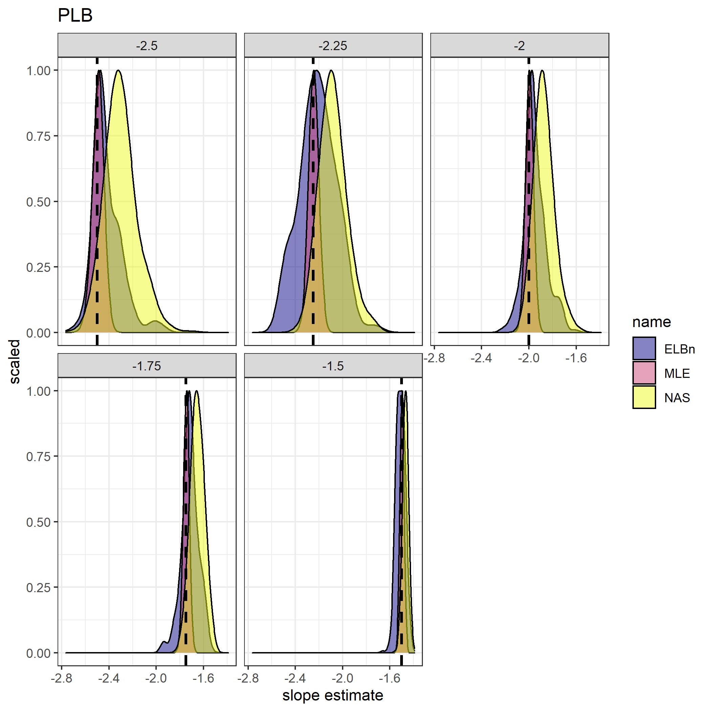

```{r setup, include=FALSE}
knitr::opts_chunk$set(echo = TRUE)
```

## ABT
### attempt 1
Size spectra are fundamental descriptions of communities and are being used increasingly to assess ecological health. Numerous methods exist for estimating size spectra, each of which introduces its own unique systematic biases making direct comparisons of results difficult. But no studies have been peformed to examine if different methodologies are able to detect differences in size spectra parameters, or if the *relative* differences within a method are consistent. Therefore, we set out to answer this question to guide future research, as well as to leverage previously published results to synthesize knowledge of how size spectra relationships respond across studies. 

### attempt 2
Community body size distributions are a fundamental characteristic of natural communities related to energy availability and trophic transfer efficiency. Numerous methodologies for estimating size spectra relationships have been proposed and compared, with maximum likelihood estimates generally being the most accurate. However, to date, no study has been conducted to assess which methodologies are able to detect known differences in size spectra parameters (slope or exponent). The present study addresses this shortfall by analyzing data using common methods on data simulated from know distributions. 

## Motivation

Size spectra relationships describe the negative pattern of abundance with increasing body size. Communities across habitats, biomes, and scales have shown remarkably similar patterns, leading to body size distributions being proposed as a "universal" relationship (Pethcey and Belgrano 2010). Furthermore, deviations from this expected pattern have been demonstrated in communities which have experienced extreme anthropogenic stress, including from overfishing marine communities in the North Sea (Blanchard/Jennings (always forget which one)), and stream macroinvertebrate communities from acid mine drainage in New Zealand (Pomeranz et al. 2018). The generally consistent pattern in undisturbed communities and response to stressors of size spectra is increasing interest in the use of size spectra as a universal indicator in ecology. 

Numerous methodologies have been proposed for estimating size spectra relationships. Traditionally, body sizes (M) have been grouped together in bins, and an ordinary least squares regression on the abundance (N) within each bin has been conducted in log-log space to estimate the slope (exponent) of decreasing N in response to increasing M. Many binning methods have been proposed and used previously in the literature. However, numerous studies have shown that binning methods introduce systematic error, and are generally do not provide accurate estimates of the slope in log-log space, or the exponent in real space. Maximum likelihood estimates of the exponent describing the power law have generally been shown to provide the most accurate estimate. 

Despite the increasing consensus of MLE analyses, no study has yet been conducted to assess which method, if any, can accurately detect differences in parameters describing size spectra relationships. Knowing which methods are able to detect differences is an important goal for ecologists moving forward, particularly with the increasing interest in using size spectra relationships to characterize communities. Additionally, having an understanding of how previous estimates of size spectra parameters vary based on methodologies will allow future studies to leverage previously published results. Because of the variation in estimates based on methodologies, it is currently not possible to conduct meta-analyses synthesizing previously published data. 


## methods

1. Simulate data
  + sizeSpectra::rPLB(n = 1000, b, xmin, xmax)
  + b = c(-1.5, -2, -2.5); b = c(-1.9, -2, -2.1)
  + hypothetical environmental gradient (x) = c(-1, 0, 1) paired with b parameters above
  + Repeat simulation 1000 times (reps)
  + xmin and xmax based on macroinvertebrate sizes
  + Also use Edwards values to test sensitivity
  + Simulate from other distributions? rlnorm(), rweibull() etc.? --> Not done yet. Maybe leave out untill reviewers ask for it??
2. Analyze simulated data
  + MLE methods from Edwards et al. 2018
  + NAS = log2 bins, normalized - Pomeranz, Blanchard, etc
  + ELBn = 6 equal log bins, normalized. Woodward's group generally uses 6 equal bins. 
  + Others from Edwards' 8 methods?
3. assessment
  + which methods provide best estimate of *real* slopes?
  + what is *relative* difference in estimates? i.e. do all methods result in a relative change of 0.5 between data "groups"?
  + Do methods accurately detect no relationship across "sites"?
  + Plot estimated CSS parameter for each rep
  + OLS regression for each rep: est_css_param ~ env_gradient
4. Sensitivity
  + Change range of "x"?
  + Change range of "m" body sizes
  + More "sites"
5. Empirical data - do conclusions of previous studies vary when using different methods?
  + AMD data from Pomeranz et al. 2018
  + NEON Data from Pomeranz et al. 2022
  
## Results

Figures are supposed to come after this, not before... Latex??


\newpage


\newpage


\newpage

### No relationship


\newpage


\newpage


### Small variation of CSS over environmental gradient

\newpage


\newpage


\newpage


\newpage


## Empirical data

### Acid Mine Drainage (AMD) gradient

The data of Pomeranz et al. 2018 was re-analyzed using the three methods presented here. The goal here was to see if the main conclusions reached would vary based on methodologies. 


\newpage


\newpage

### Environmental Temperature Gradient


\newpage


## Conclusions
+ MLE offers the best estimates of individual CSS parameters, and the best estimate of their relative change across hypothetical gradients
+ Normalized binning methods generally overestimate CSS parameters (i.e., "shallower" slopes than expected)
+ Normalized Binning methods (ELBn, NAS) *generally* correctly estimate the relationship across hypothetical and empirical gradients. 
+ Need to determine if it's possible to correctly propagate error / systematic bias in estimates, but the present study indicates that comparing the *relative* changes across gradients in different studies should be reasonable. 

## SI

Sensitivity analyses. Need to come back to these and add captions and think about implications

### Large X (-100, 100)


\newpage


\newpage

### Small body size range (m) (1, 100)


\newpage


\newpage


\newpage


\newpage

