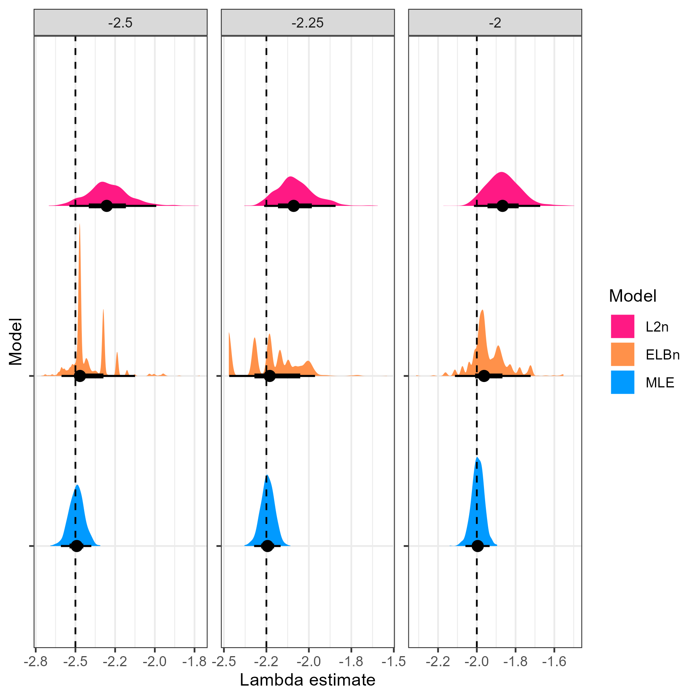
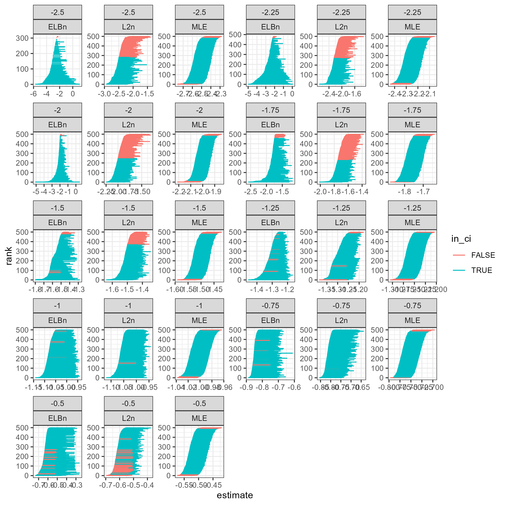

```{r setup, include=FALSE}
knitr::opts_chunk$set(
  echo = TRUE)
library(tidyverse)
```

# Supplementary material {.unnumbered}

```{=tex}
\beginsupplement
```

# ELBn bin widths  

The ELBn method uses six bins of equal width on a logarithmic scale. To illustrate how the widths of these bins varies, we provide the following example when the body sizes range from 1 to 100 g vs 1 to 100g. 

```{r, echo = FALSE, message=FALSE}
dw_range_100 <- c(1, 100)

elbn_100 <- exp(seq(floor(log(min(dw_range_100))),
                          ceiling(log(max(dw_range_100))),
                          length.out = 7))

dw_range_1000 <- c(1, 1000)

elbn_1000<- exp(seq(floor(log(min(dw_range_1000))),
                          ceiling(log(max(dw_range_1000))),
                          length.out = 7))

elb_df <- data.frame(x = c(elbn_100[1:6], elbn_1000[1:6]),
           xend = c(elbn_100[2:7], elbn_1000[2:7]),
          y  = rep(c("range = 100", "range = 1000"), each= 6),
          yend = rep(c("range = 100", "range = 1000"), each= 6),
          color = rep(c("black", "red"), 6)) 


l2n_100 <- 2^(floor(log2(min(dw_range_100))):
                  ceiling(log2(max(dw_range_100))) )

l2n_1000 <- 2^(floor(log2(min(dw_range_1000))):
                  ceiling(log2(max(dw_range_1000))) )

# length(l2n_100)
# length(l2n_1000)

l2n_df <- data.frame(x = c(l2n_100[1:7], l2n_1000[1:10]),
           xend = c(l2n_100[2:8], l2n_1000[2:11]),
          y  = c(rep("range = 100", 7),rep("range = 1000", 10)),
          yend = c(rep("range = 100", 7),rep("range = 1000", 10)),
          color = c(rep(c("black", "red"), length.out = 7), rep(c("black", "red"), length.out = 10))) 
```

```{r, echo=FALSE}
elb_df %>%
  slice(1:5, 7:10) %>%
  ggplot(aes(x = x,
             xend = xend,
             y = y,
             yend = yend,
             color = color)) +
  geom_segment(linewidth = 3,
               linejoin = 'bevel',
               lineend = 'butt') +
  geom_point(shape = "|", size = 7, color = "black") +
  theme_bw() +
  coord_cartesian(xlim = (c(0, 50))) +
  labs(x = "body size",
       y = "") +
  theme(legend.position = "none") 
  
```
Figure S1. The edges of the first 4 bins are shown when the body sizes range from 0-100 (bottom line) and 0-1000 (top line). The bins have alternating colors, and black segments are used to emphasize bin edges. As you can see, the range of the smallest bins are similar, but the edges quickly diverge in the large bin sizes. Only the first 4 bins are shown, and the image is cropped for visualization (i.e., the edges of the last bins are not shown). 

# L2n bin widths  

To contrast the variable bin widths, we show that the widths of the bins in the L2n method are always the same, but the number of bins changes to accomodate the range of body sizes present. 

```{r, echo=FALSE}
l2n_df %>%
  ggplot(aes(x = x,
             xend = xend,
             y = y,
             yend = yend,
             color = color)) +
  geom_segment(linewidth = 3,
               linejoin = 'bevel',
               lineend = 'butt') +
  geom_point(shape = "|", size = 7, color = "black") +
  theme_bw() +
  #coord_cartesian(xlim = (c(0, 50))) +
  labs(x = "body size",
       y = "") +
  theme(legend.position = "none") +
  scale_x_log10()
```


Figure S2. The edges of all bins for the L2n method are shown when body sizes range from 0-100 (bottom line) and 0-1000 (top line). The bins have alternating colors, and black segments are used to emphasize bin edges. As you can see, the bin widths are identical, but the number of bins increases with the range of body sizes in the data. The plot is presented on a log~10~ scale for visualization. 

# Top panel of Figure 2, main text


Figure S3. The variation in the distributions of $\lambda$ estimates for "steep" values in Figure 2 in the main text makes it difficult to compare them with the "shallower" distirbutions. Here, we repeat just the top panel of Figure 2 from the main text to show the variation in estimates across methods. As in the other values of $\lambda$, MLE is the most accurate and precise. The L2N method performs slightly worse, and the ELBn method is much more variable, likely due to the fact that the presence/absence of even a single large individual could drastically alter the widths of the bins present within an individual simulation replicate (See main text). 


# $\lambda$ and relationship estimates

In the main analysis, we sampled body size values from bounded power law distributions while varying the $\lambda$ exponent which describes the distribution. For the results presented in the main text, we held the number of body size values constant at n=999, held the number of sites at 5, scaled the environmental gradient from -1 to 1, and set the minimum and maximum body sizes to $0.0026$ and $1.2 *10^3$ respectively. Here, we plot the mean and standard deviation of the absolute value of deviations of the estimates from the known $\lambda$ values for the main results, and when varying the number of body sizes sampled (n = 200, 500, 5000, 10000), varying the number of sites (3, 10), increasing the scale of the environmental gradient (-100 to 100) and decreasing the range of body sizes (min = 1, max = 100). Generally, the results reported in the main manuscript are robust to changing these parameters: the MLE estimate is nearly always closer to the known parameters, and the variation in these estimates is usually smaller than the binning methods.

## Sample size, $n$

The number of observations in our simulations may bias the results. Therefore, we repeated the simulations described in the main, but varied the number of body size values sampled. We tested values of $n = (200,~500,~999,~5000,~10~000)$. All other parameters of our simulations were kept the same as the simulations presented in the main text. 

All methods improved with increasing sample size (Fig. S1). However, the accuracy of the MLE method was far superior. For example, the average absolute deviation for the MLE method with only 200 body sizes values was similar to the ELBn method with 5,000 body size values and smaller than the L2n method with 10,000 body size values (Table S1). 


```{r, echo=FALSE, results='asis', message=FALSE}
library(knitr)
table1 <- read_csv("tables/abs_dev_n_vary.csv") %>%
  mutate(diff_abs_mean = round(diff_abs_mean, 3),
         diff_abs_sd = round(diff_abs_sd, 3)) %>%
  rename(method = name,
         "Body sample size" = body_n,
         "mean abs diff"=diff_abs_mean,
         "SD abs diff"=diff_abs_sd)
kable(table1,
         caption = "Table S1. Deviation of estimates across methods for different sample sizes of body size values. The mean and standard deviation for each row (mean abs diff and sd abs diff, respectively) in the table are calculated across all replicates for each value of lambda (1000 reps * 5 lambda values = 5000 values.",
      padding = 10)
```


## Range of values for hypothetical environmental gradient (x) and body sizes (m)

We also wanted to ensure that our results were not sensitive to the values for the hypothetical gradient or the range of body sizes sampled. For this, we varied the values of the hypothetical gradient from -100 to 100, instead of from -1 to 1 as in the main text while keeping all other parameters of the simulation as described in the main text. We found no differences in the deviation of estimates when the hypothetical gradient was changed across any of the methods (Table S2). 

When the range of body sizes sampled was reduced to be from 1 to 100, the ELBn method had slightly greater absolute deviations (0.02) from the known values of $\lambda$, although the variation in the estimates was reduced by ~0.016 (Table S2). In contrast, the L2n method had generally lower absolute deviations (0.05) and lower variability (0.04) with smaller body size ranges. Finally, the MLE method had slightly higher absolute deviations (0.004) and variability (0.001) when the range of body sizes was reduced, but was more similar to estimated values presented in the main results (Table S2). 

```{r, echo=FALSE, results='asis', message=FALSE}
library(knitr)
table2 <- read_csv("tables/si_table2.csv") %>%
  mutate(diff_abs_mean = round(diff_abs_mean, 3),
         diff_abs_sd = round(diff_abs_sd, 3)) %>%
  rename(method = name,
         "mean abs diff"=diff_abs_mean,
         "SD abs diff"=diff_abs_sd)
kable(table2,
         caption = "Table S2. Deviation of estimates across methods when the values of the hypothetical gradient (large x) and the range of body sizes (small m) are changed compared with the results presented in the manuscript (main). ")
```


## Varying number of sites

The results presented in the main text used five sites equally spaced across a hypothetical environmental gradient. We also ran the simulations using 3 and 10 sites, while keeping all other parameters as described in the main text. Generally, the average absolute deviation in estimates increased with the number of sites, whereas the variation in the deviations decreased, although the magnitude of these changes was slight (Table S3). The change in both of these metrics was the smallest for the MLE method (both = 0.001) and was approximately 0.007 to 0.012 for the absolute deviations and variation in the binning methods. 

```{r, echo=FALSE, results='asis', message=FALSE}
library(knitr)
table3 <- read_csv("tables/si_table3.csv") %>%
  mutate(diff_abs_mean = round(diff_abs_mean, 3),
         diff_abs_sd = round(diff_abs_sd, 3)) %>%
  rename(method = name,
         "mean abs diff"=diff_abs_mean,
         "SD abs diff"=diff_abs_sd)
kable(table3,
         caption = "Table S3. Deviation of estimates across methods when the number of sites was changed. The results presented in the main text use 5 sites.")
```


# Altering the number of replicates  

The results presented in the main text for experiment 2.1 use 1000 replicates for each scenario. This number was chosen arbitrarily - we wanted a large enough number to capture the variability, but a small enough number to make repeated simulations tractable. Here, we alter the number of replicates to show how the results presented in the main text were largely invariant to this decision. 

![Figure S5. We varied the number of replicates (n = 10, 50, 100, 200, 250, 500, 750, 1000) and plotted the distribution of $\beta$ estimates across the three $\lambda$ scenarios. The point represents the median of the distribution, and the bold and narrow bars represent the 66th and 95th percentile of the distributions, respectively. There was some variation in estimates when n < ~250, but generally the results were surprisingly robust to the number of replicates chosen. Note that the y-axis varies across rows.](figures/SI_vary_rep_n.png)

# Confidence intervals  

We examined the proportion of 95% Confidence Intervals which had the true value for site specific $\lambda$'s (S6) as well as the CI's for the $\beta_{env}$ across $\lambda$ scenarios (S7) as well as when the effect size of $\beta_{env}$ varies. 




