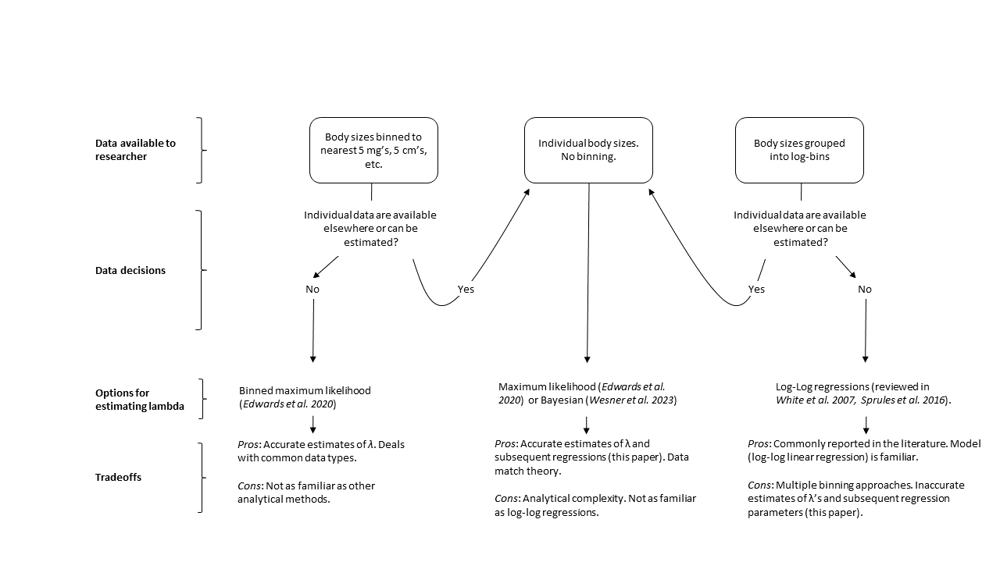

```{r setup, include=FALSE}
knitr::opts_chunk$set(
  echo = TRUE)
library(tidyverse)
```

![Figure 1. Conceptual figure of the simulation procedure used in experiment 2. A) we set $\lambda$ (points) to vary at a known relationship ($\beta$, dashed line). B) Using known values of $\lambda$, we sampled 999 body sizes for each site. C) We estimated site-specific $\lambda$ using the three methods (ELbn, L2n, MLE, see main text) and plotted them across the hypothetical environmental gradient (points, colored by method). D) We then estimated $\beta$ using OLS regressions for each method separately (colored lines). E) We repeated A-D 1,000 times to get a distribution of $\beta$ estimates. F) We compared the distribution of $\beta$ estimates (colored density plots) with the known values of $\beta$ (dashed vertical line).](conceptual.png)


![Figure 6. Estimates of change in exponent for size-abundance relationships across gradients from empirical data estimates. Panels A and C show the individual λ estimates for each site and the line shows the estimated relationship based on method (color) for the natural pollution and temperature gradients, respectively. Panels B and D show the mean estimated relationship coefficient ($\beta$, point) ± 1 standard deviation (error bars) from the OLS model for both empirical data sets. All the methods estimate the same sign of the relationship, but the estimates from the binning methods are generally larger than the MLE estimates.](figures/empirical_combined.png)

