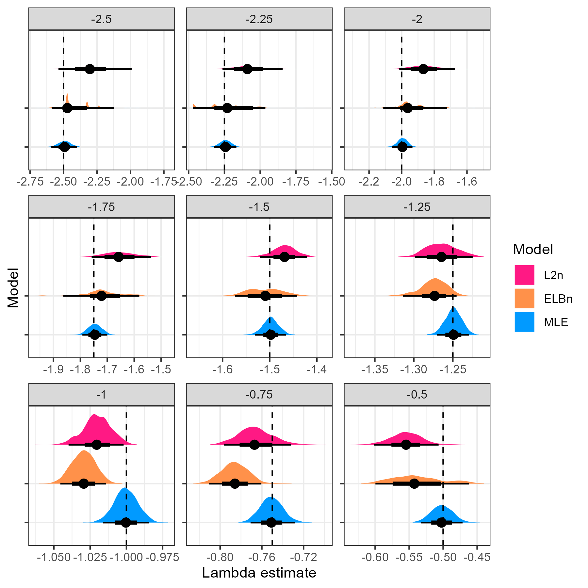
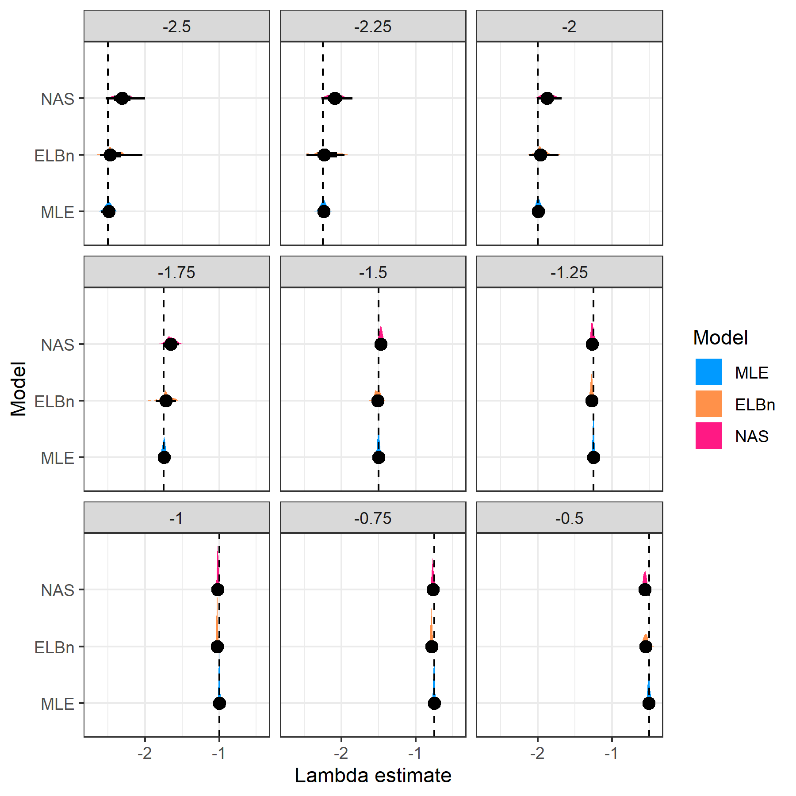

```{r setup, include=FALSE}
knitr::opts_chunk$set(echo = TRUE)
library(tidyverse)
```

Quick update post discussion on 10/6

It seemed to me that there were three main points to cover based on our discussion.
1. How do $\lambda$ estimates change across known "shallow" to "steep" values?
2. How do our estimates of the relationships of $\lambda$ differ across "lambda windows"?
3. how do our estimates perform when we have a strong or weak relationship (i.e. $\beta_1$) across a gradient?


# 1 $\lambda$ estimates




**NOTE** the difference in x-axis scale. 
The MLE (blue) distribution is nearly always centered on the known value of lambda exponent (dashed line, and facet title). 

For reference, here is the plot without allown the x-axis to vary. I think it's really hard to see anyhting in this, but the varying x-axis above is also hard to intuit, so not sure which to use. 



This figure shows that methods are comparble when lambda = ~-1, but are systematically biased at extreme lambda values. Also note that the theoretical exponent for abundance spectra are $\lambda = 2$, and there is considerable variation at this point in the figure. 


# 2 lambda "windows"

Because of the markedly different performance of the two binning methods at steep and shallow values of lambdas, we first investigated how well the methods capture a known relationship of beta = -0.5 across a hypothetical environmental gradient. The lambda "windows" are steep (-2.5, -1.5), medium (-2, -1) and shallow (-1.5, -0.5). 


The distribution of relationship estimates from the MLE method (blue) is approximately centered at the known relationship value. The distribution is widest in the "steep" window, but is still markedly narrower than the binning methods. In addition to having much wider distributions, the binning methods systematically overestimate the known relationship. 

# 3 varying the known relationship

Finally, we were interested in finding if the three methods performed differently with varying values of the known relaitonship. Here, we present estimates


Finally, we can also plot the distribution of relationship estimates


All the methods perform well when no relationship is present. The performance of the binning methods (median values) declines, with relationships being systematically over estimated. Likewise, the width of the distributions increases with stronger relationships across a hypothetical gradient. However, the distribution of estimates from the MLE method is nearly always centered at the known value, and has markedly narrower distributions. 